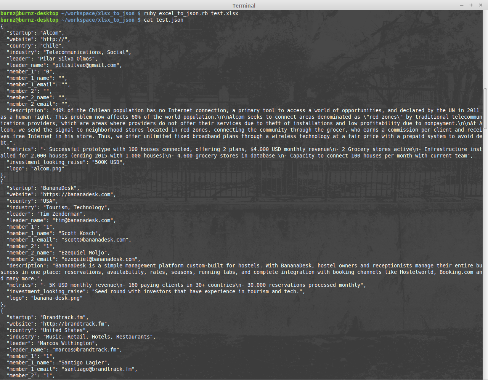

# XLSX to JSON

Aplicación de línea de comandos que transforma archivos tipo Excel (.xlsx) a formato JSON.

## Instrucciones

1. Instala las dependencias necesarias utilizando bundle:

        bundle install

2. Ejecuta el programa pasando como argumento el nombre del archivo .xlsx (asegurate que esté en el mismo directorio):

        ruby excel_to_json.rb nombre-del-archivo.xlsx 

3. Disfruta!

## Demo

